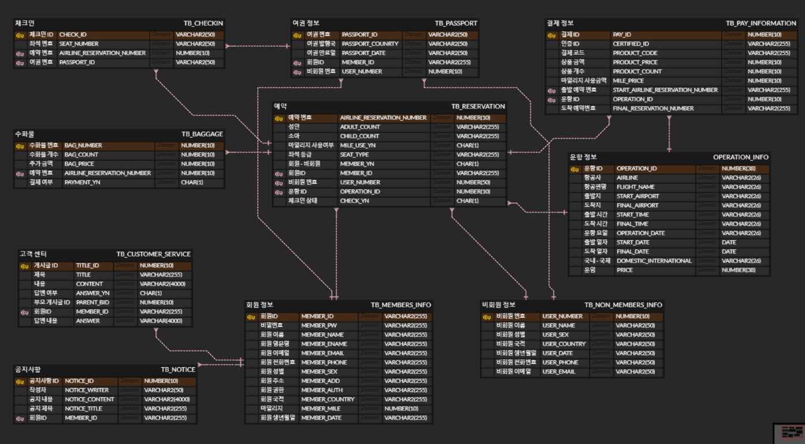

# team project - greenairline
[데모 사이트](http://greenairline.shop)  
일반 유저 - id : aaaa , pw : 123123  
어드민 = id : admin , pw : admin1  
[ppt](https://docs.google.com/presentation/d/1q3qLtK26Cb5xvpKUwVwGviBzMQQWE09zeplKLFlILgs/edit#slide=id.p1)

---
# 목차
[1. 목적](#목적)  
[2. 사용 기술](#사용기술)  
[3. 팀원 소개](#팀원소개)  
[4. 기능 소개](#기능소개)  
 
---

# 목적  
• 교육생으로서 최대한 다양한 기능이 있는 프로젝트를 고민하다 항공사 사이트로 주제 선택  
• 항공사 사이트는 회원, 비회원, 마일리지, 결제, 예약, 조회 등 많은 기능이 있음  
• 참고 : 아시아나, 대한항공  

---
# 사용기술
프론트 - 리액트, typescript, redux  
백엔드 - java, Spring Boot, Spring Security, jpa, jwt, logback  
db - oracle cloud db  
ide - intelij ide, vs code  
버전관리 - github, git  
---
# 팀원소개
팀장 - 강상민 : 예약 페이지,항공권 조회 페이지,예약 완료 페이지  
팀원 - 이주영 : 깃허브 관리, 로그인 및 회원가입, 마이페이지, 관리자 페이지, aws  
     - 이지우 : 꼬릿말, 예약 조회, 1:1 문의, 공지사항, db관리, erd 작성  
     - 박유빈 : 체크인 조회, 체크인 진행, 체크인 확정  
     - 권진욱 : 고객센터, 공지사항, 자주 찾는 질문, 1:1 문의  
     - 남희현 : nav바, 간편 항공권 예약, 여행 추천지  

---
# 기능소개
1. erd 
2. [동영상](https://tv.kakao.com/v/443077911)

